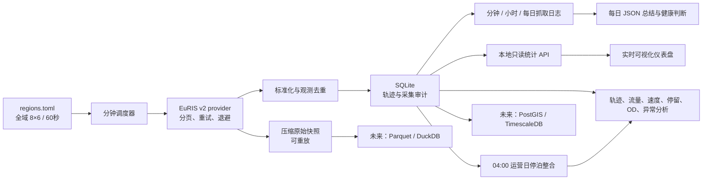

# 荷兰 AIS / 船舶轨迹采集基础项目

这个项目已经具备一个可运行的第一版采集框架：

- 荷兰地理范围被拆成 `8 × 6` 网格，全部 48 个格子每 60 秒采集一次。
  不再设置重叠的重点区域，避免同一位置被全国层和重点区域重复请求。
- 自动跟随 EuRIS `nextPageLink`，只在所有分页完整时才把运行标记为成功。
- 保存压缩原始快照，并把常用字段标准化到 SQLite；重叠区域的数据会去重，
  但采集来源关系仍然保留。
- 每天按荷兰本地时间 `04:00–次日 04:00` 形成一个运营日；04:15 自动生成
  停泊整合层，同时完整原始数据保持不变。
- 原始 `.json.gz`、标准化 `observations/raw_json` 和采集来源关系作为
  中间层；对应运营日整合成功后，按 24 小时运营日批次自动清理。
- 失败、页数、数据量、耗时和原始文件路径都写入审计表。
- 自动形成分钟、小时和运营日抓取统计；每天生成带健康判断的 JSON 抓取
  总结。控制台采集日志同时轮转保存到 `data/logs/collector.log`。
- 提供本地实时可视化界面，显示全国 48 网格、抓取趋势、关键指标、最近
  请求、停泊整合和每日健康总结。

> 范围说明：当前数据源是 EuRIS 的船舶 track API。这里的“荷兰全域”指在
> 荷兰 bbox 内抓取 EuRIS 可提供的内河航运轨迹，不等同于岸基接收机产生的
> 原始 NMEA AIS，也不能保证荷兰北海离岸水域的完整覆盖。若后续研究需要完整
> 海岸/离岸 AIS，应增加有明确授权的数据源适配器。

EuRIS 要求在使用其服务时保留来源说明；原始快照已经写入：
`API/Service Tracks incorporated from EuRIS (eurisportal.eu)`。

## 快速启动（Windows PowerShell）

```powershell
Set-Location C:\DT\ship_analysis
powershell -ExecutionPolicy Bypass -File .\scripts\setup.ps1
```

查看展开后的 48 个采集目标：

```powershell
.\.venv\Scripts\python.exe -m ship_analysis plan
```

对全荷兰的全部 48 个切片采集一次：

```powershell
.\.venv\Scripts\python.exe -m ship_analysis collect --area nl_coverage
```

启动持续调度器（前台运行，`Ctrl+C` 安全停止）：

```powershell
powershell -ExecutionPolicy Bypass -File .\scripts\run_collector.ps1
```

如果当前 PowerShell 没有 `EURIS_API_TOKEN`，脚本会提示粘贴 token，输入过程
不会回显，token 只存在于本次进程环境中。看到连续的 `fetch-ok` 日志即表示
正在采集。不要关闭该 PowerShell 窗口；需要停止时按 `Ctrl+C`。

检查采集状态：

```powershell
.\.venv\Scripts\python.exe -m ship_analysis status
```

## 可视化统计界面

在另一个 PowerShell 窗口启动界面：

```powershell
Set-Location C:\DT\ship_analysis
powershell -ExecutionPolicy Bypass -File .\scripts\run_dashboard.ps1
```

脚本会打开 [http://localhost:3000](http://localhost:3000)。保持这个窗口
运行；按 `Ctrl+C` 可以停止界面。本地页面每 30 秒从只读接口刷新 SQLite
统计，采集器仍使用前面的 `run_collector.ps1` 在独立窗口持续运行。

界面包括：

- 当前采集器是否在线、最近抓取时间和最新网格；
- 本分钟、本小时和当前运营日的返回量、新增量、成功率与 P95 耗时；
- 最近 60 分钟、24 小时和 14 个运营日的吞吐趋势；
- `8 × 6` 全国网格热度、更新新鲜度和失败状态；
- 最近 12 次 bbox 请求；
- 最新每日抓取总结和停泊整合数量。

界面只返回聚合指标和网格编号，不返回 EuRIS token、`raw_json`、船舶身份
字段或具体轨迹位置。接口地址是
`http://127.0.0.1:8765/api/dashboard`，默认只允许本机页面跨域读取。

托管页面使用构建时的安全聚合快照，因为互联网页面无法直接访问电脑上的
SQLite；研究现场应以本机实时界面为准。需要手动更新托管快照时先运行：

```powershell
.\.venv\Scripts\python.exe -m ship_analysis dashboard-snapshot
```

## 抓取日志、分钟/小时/每日统计

持续调度器启动后会同时维护三种日志：

1. `data/logs/collector.log`：与控制台相同的持久化运行日志，包括每个网格的
   `fetch-start/fetch-ok/fetch-failed`，以及 `minute-summary`、
   `hour-summary` 和 `daily-summary`。单文件达到 10 MB 后轮转，保留 14 个
   历史文件。
2. SQLite `collection_period_stats`：分钟、小时和运营日结构化统计。该表是
   长期审计数据，不随原始中间层清理。
3. `data/summaries/YYYY/MM/collection-summary-YYYY-MM-DD.json`：每天的完整
   抓取总结，可直接供后续 Python、Power BI 或其他分析程序读取。

实时查看日志：

```powershell
Get-Content .\data\logs\collector.log -Tail 50 -Wait
```

查看最近 20 分钟：

```powershell
.\.venv\Scripts\python.exe -m ship_analysis collection-log --period minute --limit 20
```

查看最近 24 小时或最近 7 个运营日：

```powershell
.\.venv\Scripts\python.exe -m ship_analysis collection-log --period hour --limit 24
.\.venv\Scripts\python.exe -m ship_analysis collection-log --period day --limit 7
```

表格中的主要数量不能混用：

- `RECEIVED / received_item_count`：所有 EuRIS 网格请求返回条数之和，是
  “接口抓到多少条”的口径；同一位置若被两个边界网格返回，可能计算两次。
- `UNIQUE / unique_item_count`：每次请求内部去重后的条数之和；仍不做跨网格
  去重。
- `NEW / new_observation_count`：本次真正新写入 `observations` 的唯一观测数。
- `OLD / existing_observation_count`：此前已经写入、这次再次被看到的观测数。
- `distinct_observation_count`：保留来源关系时，跨请求、跨网格精确去重后的
  数量。当天中间层清理后仍保留已经物化的统计，但无法从清理后的来源关系
  重新计算。
- `RUNS`：成功请求数/按配置推算的预期请求数。当前 48 个网格、每 60 秒
  一次，因此正常分钟预期 48 次，正常小时预期 2,880 次，普通 24 小时
  运营日预期 69,120 次。

预期次数按运营日实际 UTC 时长计算，因此欧洲夏令时切换日自动按 23 或
25 小时计算，不会固定套用 69,120。

### 每日抓取总结算法

每日总结与停泊整合使用相同的运营日：荷兰时间 `04:00–次日 04:00`，在
04:15 封账后由持续调度器自动生成。总结包括：

- EuRIS 渠道和采集区域分别抓取的请求数、返回条数和新增观测数；
- 预期请求、成功、失败、缺失请求和 48 个网格覆盖；
- 接口返回量、请求内去重量、新增量、重复量及精确跨网格去重量；
- 每分钟、每小时峰值，活跃采集分钟数和请求耗时 P95；
- 分页 `count` 变化、页内重复和 bbox 外返回等质量信号；
- 当天 `position/stationary` 停泊整合状态与数量。

健康等级使用确定性规则，方便复算和告警：

- `healthy`：计划完成率至少 98%、请求成功率至少 99%、48 个网格均出现，
  且没有分页异常；
- `warning`：未达到上述健康条件，但计划完成率仍至少 90%、请求成功率仍
  至少 95%；
- `critical`：没有成功数据，或计划完成率低于 90%，或请求成功率低于
  95%；
- `no_data`：该运营日完全没有采集运行。

手动生成或查看已经封账的运营日总结：

```powershell
.\.venv\Scripts\python.exe -m ship_analysis daily-summary --date 2026-07-25
```

重新计算已有总结：

```powershell
.\.venv\Scripts\python.exe -m ship_analysis daily-summary --date 2026-07-25 --force
```

仅用于现场检查时，可以生成尚未结束的临时总结；它会因为缺少后续时段而
显示较低的计划完成率，不能当作最终日报：

```powershell
.\.venv\Scripts\python.exe -m ship_analysis daily-summary --date 2026-07-26 --allow-incomplete --force
```

## 采集和运营日配置

全国范围、频率和停泊整合参数都在
[`config/regions.toml`](config/regions.toml)：

```toml
[[areas]]
id = "nl_coverage"
bbox = [3.20, 50.70, 7.30, 53.70]
interval_seconds = 60
grid_columns = 8
grid_rows = 6
enabled = true
```

当前调度器是串行请求。一次全国实测约需 38.5 秒；持续运行时应通过状态表
监控一轮是否能在 60 秒内完成，以及是否出现 `429`、失败或积压。

### 每日停泊整合

运营日采用 `Europe/Amsterdam` 本地时间 `04:00–次日 04:00`。选择 04:00
是为了避开午夜日期切换、欧洲夏令时通常发生的 02:00–03:00 窗口，以及
常见的清晨启航时段。系统在 04:15 处理刚结束的运营日，为最后一轮采集留出
15 分钟。

一组连续观测只有同时满足以下条件才折叠为一条 `stationary` 记录：

1. 使用同一个非空 EuRIS `trackID`；
2. 至少持续 10 分钟且至少有 5 次来源观测；
3. 相邻观测间隔不超过 5 分钟；
4. 所有位置位于 30 米半径内；
5. 期间没有任何明确的 `isMoving=true`。

否则每个来源观测保留为 `position` 记录。算法不使用尚未确认单位的
`speedGround` 作为停泊阈值。跨越 04:00 的长期停泊会按运营日切成相邻的
两段，后续分析可按 `trackID`、时间连续性和位置距离再次连接。

持续调度器会在后台自动处理尚未整合的完整运营日，也可以手动运行：

```powershell
.\.venv\Scripts\python.exe -m ship_analysis compact-day
```

也可以指定一个已经结束并超过 04:15 封账时间的运营日。未结束的运营日会被
拒绝，防止半天数据被误标为完整。重新生成已经完成的某一天：

```powershell
.\.venv\Scripts\python.exe -m ship_analysis compact-day --date 2026-07-26 --force
```

### 24 小时中间层清理

长期保留的数据只有：

- `daily_track_records.record_type = position`：没有被判定为停泊的分钟级
  有效位置；
- `daily_track_records.record_type = stationary`：连续不变位置合并形成的
  停泊段；
- `data/compacted` 中对应的每日 gzip；
- `collection_runs` 中不含明细的轻量采集审计。

每个 04:00–次日 04:00 运营日整合成功后，清理该运营日的中间层：

1. `data/raw` 原始 EuRIS gzip；
2. `collection_observations` 来源关系；
3. 不再被其他未清理运营日引用的 `observations`；
4. 随 `observations` 一起清理的完整 `raw_json`。

跨越日界线且仍被下一运营日引用的观测不会提前删除。删除时间和原因记录在
`collection_runs`；任何未完成日整合的数据都不会清理。

预览当前可清理中间层，不执行删除：

```powershell
.\.venv\Scripts\python.exe -m ship_analysis prune-staging
```

手动执行清理：

```powershell
.\.venv\Scripts\python.exe -m ship_analysis prune-staging --apply
```

## 数据位置

```text
data/
├── raw/euris_v2/YYYY/MM/DD/<area>/*.json.gz
├── compacted/YYYY/MM/operational-day-YYYY-MM-DD.json.gz
├── logs/collector.log
├── summaries/YYYY/MM/collection-summary-YYYY-MM-DD.json
└── ship_analysis.db
```

SQLite 中的主要表：

- `collection_runs`：每次 bbox 采集的状态、页数、数量、分页内重复、
  上游总数差值、耗时和错误。
- `observations`：标准化位置记录。
- `collection_observations`：一条位置来自哪些采集运行/区域的溯源关系。
- `daily_compaction_runs`：每日整合的时间边界、参数、数量和状态。
- `daily_track_records`：未折叠的 `position` 与停泊段 `stationary`。
- `collection_period_stats`：分钟、小时和运营日抓取统计。
- `daily_collection_summaries`：每日健康等级、中文总结、完整 JSON 和输出
  文件路径。

`data/raw`、`observations/raw_json` 和 `collection_observations` 是当天
整合所需的中间层，不是长期分析接口。长期分析统一使用
`daily_track_records` 或 `data/compacted`。

详细语义见 [`docs/DATA_MODEL.md`](docs/DATA_MODEL.md)，后续建设顺序见
[`docs/ROADMAP.md`](docs/ROADMAP.md)。当前接口与网格策略的实测见
[`docs/VALIDATION.md`](docs/VALIDATION.md)。

## 架构



## 当前设计边界

- 默认使用已验证的 EuRIS v2 bbox 响应，因为它稳定返回
  `items / nextPageLink / count`。EuRIS 在 2026 年新增了 Tracks v3；
  v3 适配应作为独立 provider 完成契约测试后再切换。
- 不把 `trackID` 当作永久船舶身份，也不把 `mmsi=0`、空 `eni` 或
  `ais_ship_type=-1` 当作真实类别。
- `speed_ground` 暂时保留源值名称，不在字段名中强行标注节或 km/h；
  做速度分析前必须核实接口定义与样本。
- 当前是研究型单机基线。长周期全量采集应按 `docs/ROADMAP.md` 迁移到
  Parquet 与 PostGIS/TimescaleDB，并加入监控、备份和保留策略。
- `daily_track_records` 是长期分析层。原始 gzip、标准化观测和来源关系只
  保留到对应 24 小时运营日成功整合；失败日保留中间层等待重试。
- EuRIS bbox 是实时变化的分页列表，不是事务冻结快照。框架会记录分页内
  重复和 `实际条数 - 接口初始 count`；做精确断面流量时应优先使用较小 bbox
  或 fairway-section 接口，并以位置时间去重。
- EuRIS 偶尔会返回请求 bbox 外缘附近的位置；这些记录会保留在原始层，
  `collection_observations.inside_requested_bbox` 可用于严格空间过滤。

## 测试

项目除 Python 标准库外只依赖 `tzdata`，由安装脚本自动安装：

```powershell
.\.venv\Scripts\python.exe -m unittest discover -s tests -v
```

测试 personal token 和潜在的增量连接（token 通过隐藏输入读取，不写入文件）：

```powershell
powershell -NoProfile -ExecutionPolicy Bypass -File .\scripts\test_ais_connect.ps1
```

## 数据源链接

- [EuRIS API 文档](https://developer.eurisportal.eu/docs/)
- [EuRIS Swagger API Reference](https://www.eurisportal.eu/doc/api)
- [Rijkswaterstaat AIS 说明](https://www.rijkswaterstaat.nl/water/scheepvaart/scheepvaartverkeersbegeleiding/river-information-services/automatic-identification-system)
